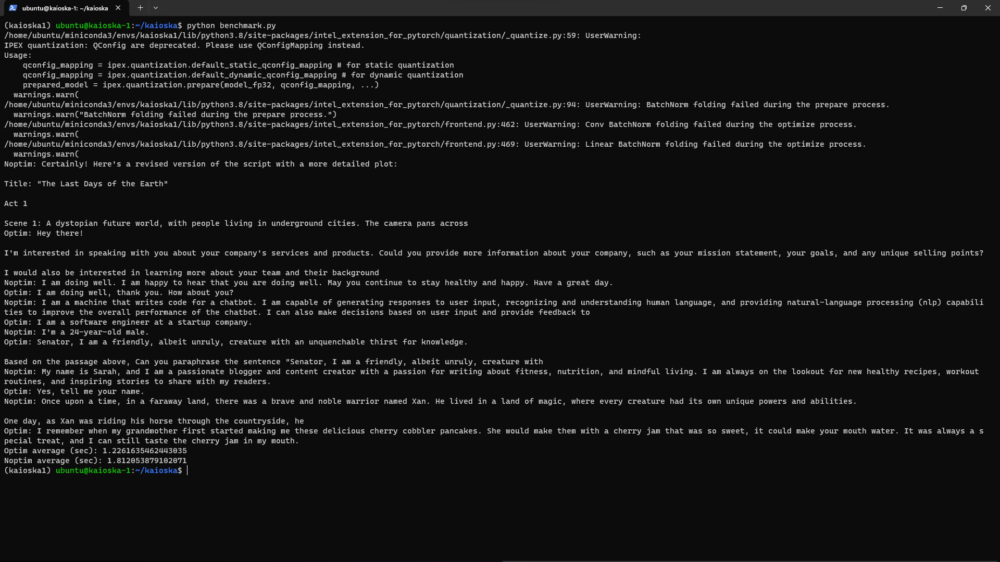

## Project: Talking kAIoska

#### Team Name - Talking kAIoska
#### Problem Statement - GenAI-Powered Customer Support Process Optimization
#### Team Leader Email - uralstech@gmail.com

### A Brief of the Prototype:
***kAIoska***: AI Talking Multilingual No-Touch Avatar-Based Information Kiosk Customer Service agents

### Benchmark:

* IPEX Optimized average inference time (sec): 1.2261635462443035
* Not optimized average inference time (sec): 1.812053879102071
  
### Tech Stack:
* Server:
    * Python-powered
    * Running on Intel Developer Cloud
    * Using HuggingFace Transformers w/ acceleration from Intel Extensions for Pytorch (IPEX), utilizing OneAPI
    * TinyLLama as the model - Quantized and optimized by IPEX
    * FastAPI for simple REST API
    * Authentication using Firebase Admin SDK
* App:
    * Powered by Unity w/ C#
    * ARCore/OpenCV for face tracking
    * Whisper AI for spoken language detection
    * Google cloud STT, TTS, Translate for speech-to-text-to-speech processing
    * Server app for main LLM
   
### Step-by-Step Code Execution Instructions (Server):
* Create a Firebase project
* Create a service account on connected GCP project
* Download `json` key file
* Run: 
```bash
export GOOGLE_APPLICATION_CREDENTIALS="path/to/service/account/key/"

pip install requirements.txt
python src/main.py
```
  
### Future Scope:
* Integration with CRMs
* Call answering/forwarding
* AI Training & Hyper-personalization